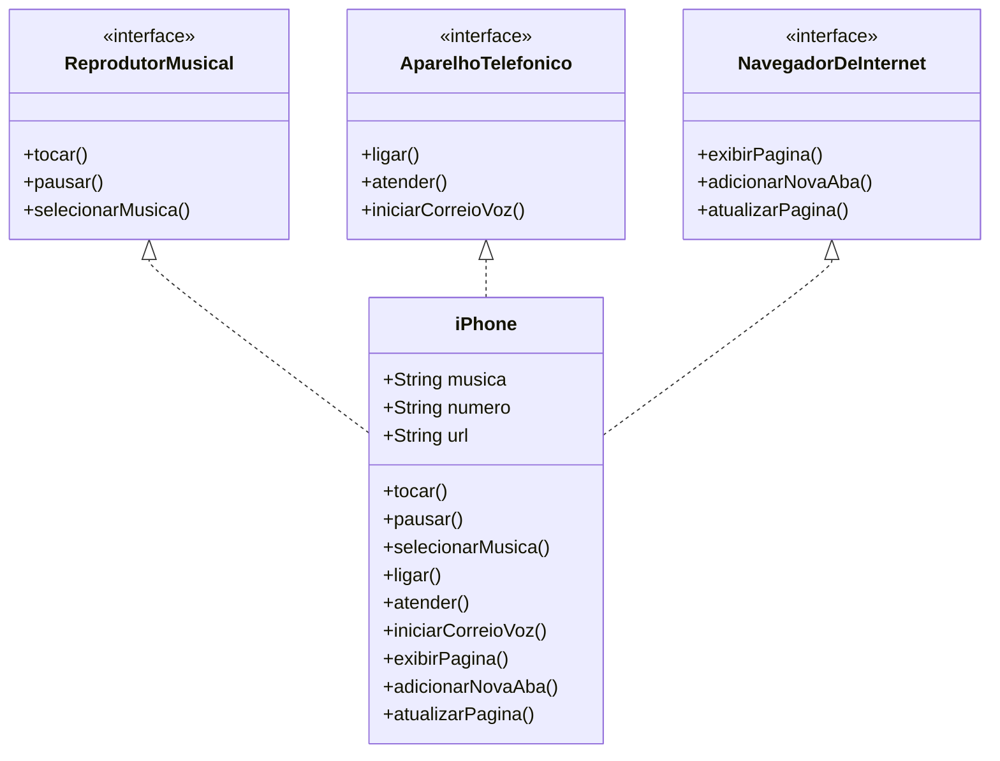

# 📱 POO - Desafio: Modelagem e Diagramação de um Componente iPhone

Este repositório contém a modelagem orientada a objetos do componente **iPhone**, com base no vídeo oficial de lançamento do iPhone em 2007. O desafio proposto pela DIO consiste em representar suas funcionalidades principais em um **diagrama UML** e, opcionalmente, implementar as classes e interfaces em **Java**.

## 🎯 Objetivo

Modelar, diagramar e (opcionalmente) implementar as funcionalidades de:

- Reprodutor Musical
- Aparelho Telefônico
- Navegador na Internet

## 📽️ Contexto

Inspirado no vídeo de lançamento do iPhone de 2007:

🔗 [Assista aqui](https://www.youtube.com/watch?v=9ou608QQRq8)  
📌 Minutos relevantes: **00:15 até 00:55**

## 🧩 Funcionalidades a Modelar

### 🎵 Reprodutor Musical
- `tocar()`
- `pausar()`
- `selecionarMusica(String musica)`

### 📞 Aparelho Telefônico
- `ligar(String numero)`
- `atender()`
- `iniciarCorreioVoz()`

### 🌐 Navegador na Internet
- `exibirPagina(String url)`
- `adicionarNovaAba()`
- `atualizarPagina()`

## 📊 Diagrama UML

O diagrama UML foi elaborado utilizando a ferramenta Mermaid para exibir em arquivos, Markdown. Também disponibilizei uma versão em .png **(UML iPhone.png)** dentro dos arquivos do projeto para facilitar a visualização e caso de bugs ou dúvidas.



## 💻Estrutura de Arquivos
A estrutura de arquivos do projeto é a seguinte:

```plaintext
📁 src/
 ┣ 📄 ReprodutorMusical.java
 ┣ 📄 AparelhoTelefonico.java
 ┣ 📄 NavegadorDeInternet.java
 ┣ 📄 iPhone.java
 ┗ 📄 Main.java
```